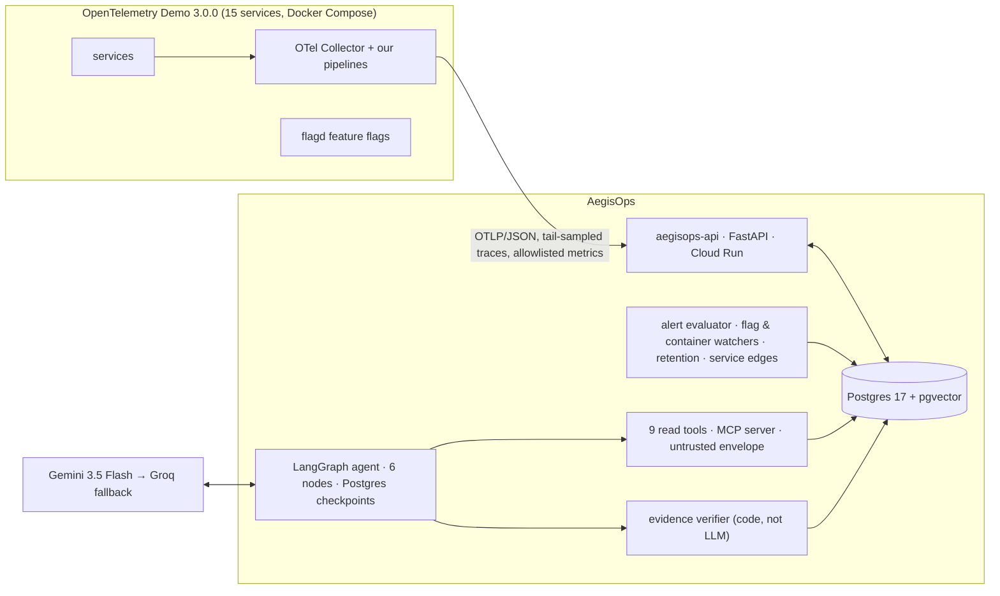

# AegisOps

**An autonomous incident-response engineer over real OpenTelemetry data.** It detects an incident in a 15-service system with deterministic rules, investigates it with an LLM agent over logs, metrics, traces and recent changes, **verifies every claim the agent makes against the telemetry store**, and proposes one of four safe operational fixes for a human to approve.

`agentic-ai` · `llm-agents` · `langgraph` · `mcp` · `opentelemetry` · `observability` · `aiops` · `sre` · `incident-response` · `root-cause-analysis` · `fastapi` · `postgresql`

> Status: **Week 3 of 13**, ahead of plan. Live API: [`aegisops-api…run.app/livez`](https://aegisops-api-875836872466.asia-south1.run.app/livez). Public replay demo, benchmark table and video arrive with Milestone M1 (31 Oct) and M2 (22 Dec). Master plan: [`docs/PROJECT.md`](docs/PROJECT.md).

## What it does

- **Detects** incidents from rules over SQL aggregates (error rate, error bursts, p95 vs baseline, memory, Kafka lag), not from an LLM. Measured live: fault → open incident in **57 s**, zero false positives in warm-up.
- **Investigates** with a fixed LangGraph: triage → plan → investigate → correlate changes → root cause → verify evidence. Nine read-only telemetry tools, every result wrapped as untrusted data, ≤ 4 KB each.
- **Correlates what changed**: flag flips, deploys, restarts and scale events are recorded as they happen and scored by recency and dependency proximity.
- **Verifies before it speaks**: every cited trace, log, metric or change is checked against the store; numbers must be within ±20 %; unverifiable citations are dropped and confidence is scaled down. On its first real run the model claimed 0.86 with an invented metric name; the verifier returned 0.57 and said why.
- **Stays inside budgets**: 15 tool calls, 60k tokens, 180 s per run; a breach still produces a partial report.
- **Runs the same code live and in replay**: captured scenarios replay deterministically for the public demo, CI and the benchmark.

**Deliberately not in v1:** writing or merging code patches, Kubernetes, canary deploys, Slack/PagerDuty integrations, multi-tenancy, model fine-tuning.

## Architecture



Full picture, built vs planned: [`docs/ARCHITECTURE.md`](docs/ARCHITECTURE.md). Every design decision with alternatives: [`docs/adr/`](docs/adr/README.md).

## Results

Not yet. The benchmark (12 faults + 3 noise scenarios × 3 episodes × 4 agent variants × 2 models, four faults held out and run once) lands in Weeks 8–11 and is published unedited in `docs/EVAL.md`, with a "where it fails" page. Until then, one honest data point from the first real run on the payment-failure scenario:

| | Claimed by the model | After verification |
|---|---|---|
| Root cause | `config_regression` (flag flip) | unchanged |
| Confidence | 0.86 | **0.57** |
| Evidence | 3 citations | 2 kept, 1 dropped: invented metric name |

## Safety model

1. **Detection and verification are deterministic code.** The LLM proposes; code decides there is an incident and checks every claim (ADR-008).
2. **Telemetry is untrusted input.** Every tool result is wrapped in `<telemetry untrusted="true">` with escaped brackets; prompts state that content inside is never an instruction. A prompt-injection scenario (S13) is part of the benchmark.
3. **Actions are unreachable without approval.** Read tools are exposed over MCP; the four actions (toggle flag, restart, scale, rollback) are an in-process module reachable only from the `execute` node after `approval`, enforced by graph topology and a test (ADR-007).
4. **Least privilege everywhere.** Node-scoped tool allowlists; allowlisted action parameters with fixed argv, no shell; admin routes fail closed; keyless cloud deploys via Workload Identity Federation restricted to this repository.
5. **Supply chain.** Lockfiles, Dependabot, dependency review (vulnerabilities + licences), CodeQL on code and workflows, secret scanning, actions pinned by SHA.

Details: [`docs/PROJECT.md` §11](docs/PROJECT.md) (threat model); `docs/SECURITY.md` in Week 13.

## Where it fails

Recorded as they happen, not curated later:

1. **Confidently wrong on day one.** With no change correlation, the model blamed a "connection refused" log and a `0 calls` reading for a service that had *no data*. Fixes: tools now say "no data" explicitly, changes are scored and handed to the model, and the verifier cuts confidence for unverifiable citations.
2. **Invented metric names.** `payment_error_rate` looks right and does not exist; dropped by the verifier.
3. **Detection has a traffic floor.** At the demo's default load the payment path sees ~5 calls/min; statistically confident detection within 60 s of the fault is at the edge. Documented in [Day 8](docs/learning/day-08-2026-09-20-alert-evaluator.md).

More in [`docs/learning/`](docs/learning/README.md), a day-by-day teaching log of everything built, every term, and what broke.

## Run locally

```bash
make install                                   # uv sync + git hooks
make db-up && make db-migrate                  # Postgres 17 + pgvector on :5433
make api                                       # http://localhost:8000/docs
make demo-up                                   # pinned OTel Demo + our collector layer (~2.5 GB RAM)
make flag name=paymentFailure variant=100%     # inject a fault; an incident opens within ~60 s
```

Investigate an incident (needs `AEGIS_GEMINI_API_KEY` / `AEGIS_GROQ_API_KEY` in `.env`, or `--recorded` for a model-free replay):

```bash
uv run aegis-investigate --service payment --alert "high-error-rate: error_rate for payment = 0.83"
uv run aegis-investigate ... --recorded packages/agent/tests/cassettes/s1_payment_failure.yaml
uv run aegis-telemetry                         # the read tools as an MCP server (stdio)
make check                                     # lint, types, 109 tests against Postgres (same as CI)
```

`make bench` arrives in Week 9.

## At 10K services and 1,000 incidents a day

Shard ingest by service and sample harder at the collector; keep the span-metrics counters (they are the exact signal) and drop raw span retention to hours; put a queue and a worker pool in front of the agent instead of running it inside the SSE request (ADR-009 is a free-tier choice); per-tenant budgets and model routing; tiered storage (hot Postgres, cold object store) with `service_edges` and postmortems as the durable, small tables; read replicas for the tools. None of the agent code changes: the tool layer and the deployment do.

## Tech stack

Python 3.13 · uv · FastAPI · SQLAlchemy 2 (async) · Alembic · Postgres 17 + pgvector · OpenTelemetry Collector (tail sampling, OTTL) · LangGraph 1.x with Postgres checkpoints · MCP SDK 2 · Gemini 3.5 Flash / Groq gpt-oss-120b via a 100-line router · pytest (109 tests, 95 %) · ruff · mypy --strict · GitHub Actions (CI, CodeQL, dependency review, Dependabot, keyless Cloud Run deploy) · Docker · Cloud Run.

## Repository map

| Path | What |
|---|---|
| `apps/api/` | FastAPI service: ingest, health, incidents API, jobs (retention, service edges, flag & container watchers), alert evaluator |
| `packages/tools/` | Nine read tools, untrusted envelope, `aegis-telemetry` MCP server |
| `packages/agent/` | LangGraph graph, schemas, verifier, change correlation, model router, cassettes, `aegis-investigate` CLI |
| `infra/otel-demo/` | Collector layer and compose override for the pinned demo |
| `config/` | Alert rules, model routing, target-specific names |
| `docs/PROJECT.md` | The master plan: requirements, schedule, changelog |
| `docs/ARCHITECTURE.md` · `docs/RUNBOOK.md` · `docs/adr/` · `docs/learning/` | Living architecture, operations, decisions, day-by-day teaching log |

## License

Apache-2.0
