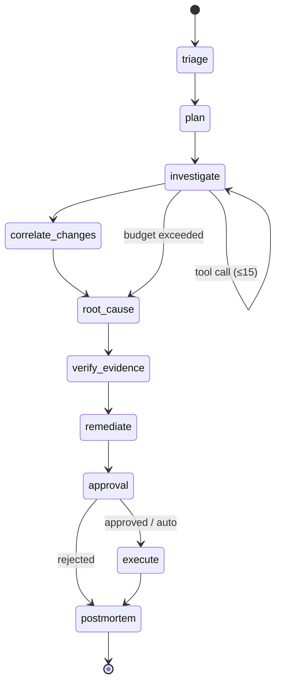

# AegisOps architecture

> Living document. Started 18 Sep 2026 (Week 1) as a copy of PROJECT.md §5–§6 plus what has actually been built; it grows with each feature and is polished in Week 13 (E12.2). Decisions are explained in [`docs/adr/`](adr/README.md). **Built** marks what exists on `main` today; **Planned** marks what the plan specifies and has not been built yet.

## 1. What the system does

AegisOps watches a real microservice system, detects an incident with deterministic rules, investigates it with an LLM agent over logs, metrics, traces and change events, verifies every claim the agent makes against the telemetry store, proposes one of four safe remediations, waits for human approval (or a pre-approved low-risk policy), executes, checks the alert cleared, and writes a postmortem it can search next time.

Two guiding rules: **LLM proposes, code verifies** (ADR-008), and **one code path for live and replay** (ADR-004).

## 2. Context

```mermaid
flowchart LR
  subgraph Target["Target system: OpenTelemetry Demo 3.0.0 (Docker Compose, laptop)"]
    SVC[15 microservices] --> COL[OTel Collector + our aegisops pipelines]
    FLAGD[flagd feature flags]
  end
  COL -- "OTLP/JSON over HTTP, gzip" --> API
  subgraph Aegis["AegisOps"]
    API["aegisops-api (FastAPI)\nCloud Run asia-south1"]
    DB[("Postgres 17 + pgvector\nlocal container / Supabase")]
    AGENT["LangGraph agent\nin-process, checkpointed"]
    ACT[Action executor]
    API <--> DB
    API --> AGENT --> DB
    AGENT --> ACT
  end
  ACT -- "toggle / restart / scale / rollback" --> FLAGD
  ACT --> SVC
  WEB["Next.js UI (Vercel)"] -- "REST + SSE" --> API
  LF[Langfuse cloud] <-- traces --- AGENT
  LLM["Gemini Flash / Groq"] <--> AGENT
```

**Built:** the whole left-to-right path from the demo into Postgres (collector layer, ingest API, tables), derived service edges, change events from flag toggles, deterministic alerting that opens incidents, the API with liveness/readiness and a read-only incidents endpoint, and the Cloud Run deployment. **Planned:** agent, actions, UI, Langfuse, LLM.

## 3. Components

| Component | Where | Tech | Responsibility | State |
|---|---|---|---|---|
| Collector layer | `infra/otel-demo/` | OTel Collector config, compose override | Fan out demo telemetry into our pipelines: tail-sampled traces, allowlisted metrics, all logs; export OTLP/JSON to the API | Built (E1.3) |
| `aegisops-api` | `apps/api/` | Python 3.13, FastAPI, SQLAlchemy 2 async, Alembic, structlog | Ingest, health probes, RFC 7807 errors; later: alerts scheduler, incidents, runs (SSE), approvals, bench results | Built: ingest + probes (E1.1, E1.2, E8.4) |
| Database | Postgres 17 + pgvector | `pgvector/pgvector:pg17` locally on :5433; Supabase in prod | Single store for telemetry, derived tables, incidents/runs, LangGraph checkpoints, embeddings (ADR-003) | Built: telemetry tables; Supabase pending (E11.5) |
| `agent` package | `packages/agent/` | LangGraph 1.x, Pydantic v2, httpx | Graph triage→plan→investigate→correlate_changes→root_cause→verify_evidence, Pydantic outputs, budgets, model router with fallback, cassettes, CLI; remediate/approval/execute/postmortem planned | Built (E3.1–E3.5, E4.1, E4.2) |
| `tools` package | `packages/tools/` | raw SQL + mcp SDK 2.x | Nine read-only telemetry tools (`ToolContext` for live/replay), untrusted envelope, `aegis-telemetry` MCP server over stdio; actions module (not MCP) comes in W6 | Built: tools + server (W3, E9.1) |
| Jobs + incidents (in the API for now) | `apps/api/.../jobs`, `.../incidents` | asyncio `JobRunner`, SQL | Retention, `service_edges` derivation, flagd change watcher, Docker container watcher (deploy/restart/scale); incident state machine | Built (E1.4, E1.5, E2.1, E2.2-obs, E2.4) |
| Alerts (in the API) | `apps/api/.../alerts` | SQL readers + `Evaluator` | Rules from `config/alerts.yaml` → `alert_rules`; every 30 s: error_rate / p95_ratio / memory / kafka lag per service → incidents via the state machine | Built (E2.3) |
| `web` | `apps/web/` (not created) | Next.js 15, TypeScript, Tailwind, shadcn/ui | Incidents list, incident detail with live SSE timeline, Benchmark, Failures | Planned (W5) |
| `bench` | `bench/scenarios.yaml` + `packages/bench/` | Python, httpx | Catalogue (16 scenarios), runner (fault → TTD → hold → revert → capture), fixtures export/import, replay command; metrics + report come in W9 | Built: catalogue, runner, capture, fixtures (E7.1, E7.2, E1.6) |
| Platform | `.github/workflows/`, `Dockerfile` | GitHub Actions, WIF, Artifact Registry, Cloud Run | CI (lint, types, tests vs Postgres, hooks, docker build), CodeQL, dependency review, Dependabot, keyless deploy with probe-before-traffic | Built (E11.2, E11.3, E11.6, E9.7) |

## 4. Data flow today (built)

1. Demo services send OTLP to the demo's collector over gRPC/HTTP.
2. Our config layer adds `traces/aegisops`, `logs/aegisops`, `metrics/aegisops` pipelines that read the same `otlp` receiver. Traces pass `tail_sampling` (keep every trace with an ERROR span, 15 % of the rest). Metrics pass an OTTL allowlist. Logs pass through. All go to the `otlphttp/aegisops` exporter: JSON encoding, gzip, retry with backoff.
3. The API's `/ingest/v1/{traces,logs,metrics}` decode (gzip, size cap), validate with Pydantic models of the OTLP/JSON subset, convert to row dicts (pure functions), and bulk-insert in one transaction. Rows without valid ids are counted in the OTLP `partialSuccess` response instead of failing the batch.
4. Rows land in `spans`, `logs`, `metric_points` with `service` denormalised, signal attributes flat in `attrs`, and resource/scope/events/links under `attrs["otel.*"]`. Histograms are one row per data point with buckets in `attrs["otel.histogram"]`.

Measured on 17 Sep: flag toggle → first ERROR spans in Postgres in 6 s; 15 services; 0 rejected rows; ~20k spans/s ingest capacity in-process.

## 5. Modes (one code path)

| | Live (laptop) | Replay (public, CI, benchmark) |
|---|---|---|
| Telemetry | Streams from the demo | Pre-captured rows tagged `scenario_id` |
| Time | Wall clock | Frozen at the capture window; tools filter by `scenario_id` |
| Actions | Real: flagd file edit, `docker compose` restart/scale/rollback | Simulated: recorded outcome from `scenarios.yaml` |
| Where | Local compose + `make api` | Cloud Run + Supabase |

The agent never knows the mode; the tool layer and the action backend do.

## 6. Agent state machine (built: triage→plan→investigate→correlate_changes→root_cause→verify_evidence; planned: remediate→approval→execute→postmortem, W5–W6)



Budgets per run: 15 tool calls, 60k tokens, 180 s. `verify_evidence` and `approval` contain no LLM. `execute` is reachable only from `approval`, enforced by a test over the compiled graph.

## 7. Data model

Built tables (migration `0001_telemetry_tables`):

| Table | Key columns | Indexes |
|---|---|---|
| `spans` | trace_id, span_id, parent_span_id, service, name, kind, start_ts, duration_ms, status_code, status_message, attrs jsonb, scenario_id | (service, start_ts), (trace_id), (scenario_id, service, status_code) |
| `logs` | ts, service, severity_num, severity_text, body, trace_id, span_id, attrs jsonb, scenario_id | (service, ts), (scenario_id, service, severity_num), (trace_id) |
| `metric_points` | ts, service, metric_name, value, unit, attrs jsonb, scenario_id | (service, metric_name, ts) |

Also built: `service_edges` (0002: hourly caller→callee call_count / err_count / p95_ms), `change_events`, `alert_rules`, `incidents` (0003; enums as VARCHAR + CHECK; incidents FK → alert_rules).

Every table has `id bigserial` and `created_at`. Planned tables: `runs`, `run_events`, `evidence`, `remediations`, `postmortems` (vector(768), HNSW), `audit_log`, `scenarios`, `bench_results`, plus LangGraph's own checkpoint tables. See PROJECT.md §6.

## 8. API surface

Built: `POST /ingest/v1/{traces,logs,metrics}`, `GET /livez`, `GET /readyz`, `GET /api/v1/incidents[?status&limit&cursor]`, `GET /api/v1/incidents/{id}`, `GET /api/v1/scenarios[/{key}]`, `POST /api/v1/admin/{retention,service-edges}/run`, `POST /api/v1/admin/capture` (X-Admin-Token). All errors are `application/problem+json` (RFC 7807). Planned: `/incidents`, `/runs/{id}/events` (SSE), `/runs/{id}/approve|reject` (admin token), `/scenarios`, `/bench/*`, `/admin/*`. See PROJECT.md §7.

## 9. Deployment and operations

- **Image:** multi-stage `uv` → `python:3.13-slim`, non-root, 76 MB. Entrypoint runs `alembic upgrade head` when `AEGIS_DATABASE_URL` is set, then uvicorn on `$PORT`.
- **CI (`ci.yml`):** lint + typecheck, tests against a `pgvector/pgvector:pg17` service container with migrations applied, pre-commit hooks, docker build + `/livez` probe. Actions pinned by SHA; `UV_FROZEN=1`.
- **Security (`codeql.yml`, `dependency-review.yml`, Dependabot):** CodeQL on Python and workflow files, weekly + per PR; dependency review fails on high severity or copyleft; grouped weekly updates.
- **CD (`deploy-api.yml`):** on push to main → `make check` → build/push to Artifact Registry (cleanup: keep 5 / delete > 30 d) → `gcloud run deploy --no-traffic` tagged `sha-<short>` → probe `/livez` on the tagged URL → shift traffic. Keyless via Workload Identity Federation restricted to this repository (ADR-012). Cloud Run: 1 vCPU, 1 GiB, timeout 900 s, concurrency 10, min 0, max 3, cpu-boost, session affinity. Budget alert ₹500.
- **Live URL:** https://aegisops-api-875836872466.asia-south1.run.app (`/readyz` is 503 until Supabase exists).
- **Runbook:** [`docs/RUNBOOK.md`](RUNBOOK.md).

## 10. Security model (summary)

Untrusted-content wrapping of every tool output; structured outputs everywhere; actions unreachable without the approval node; allowlisted action parameters and fixed argv (no shell); admin token on mutating routes; per-IP concurrency and a global daily cap in public mode; secrets only in Secret Manager / env; lockfiles, Dependabot, dependency review and SHA-pinned actions for supply chain. Full threat table: PROJECT.md §11.

## 11. Change log of this document

| Date | Change |
|---|---|
| 18 Sep 2026 | Created from PROJECT.md §5–§6 with the built/planned split after Week 1 (ingest path, platform, Cloud Run). |
| 19 Sep 2026 | Week 2 day 1: jobs (retention, service_edges, flag watcher), incident tables + lifecycle, incidents read API. |
| 20 Sep 2026 | Week 2 day 2: alert evaluator (deterministic detection, ADR-008) opens incidents; 503 on DB outage. |
| 21 Sep 2026 | Container watcher (Docker API) for deploy/restart/scale change events; uptime ping workflow. |
| 22 Sep 2026 | Tools package: nine read tools, untrusted envelope, MCP server (ADR-007). |
| 23 Sep 2026 | Agent skeleton: LangGraph graph with checkpoints, structured outputs, budgets, router, cassettes, CLI (ADR-016). Same day: evidence verifier, change correlation, follow-up round; first real model runs. |
| 24 Sep 2026 | Scenario catalogue, runner, capture (`scenarios` table, migration 0004), fixtures, replay command. |
